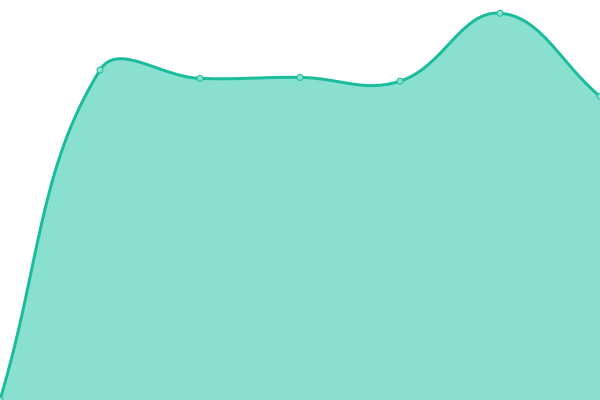

# [📈 Live Status](https://bdrops-GmbH.github.io/upptime): <!--live status--> **🟧 Partial outage**

This repository contains the open-source uptime monitor and status page for [bdrops GmbH](https://bdrops.de), powered by [Upptime](https://github.com/upptime/upptime).

With [Upptime](https://upptime.js.org), you can get your own unlimited and free uptime monitor and status page, powered entirely by a GitHub repository. We use [Issues](https://github.com/bdrops-GmbH/upptime/issues) as incident reports, [Actions](https://github.com/bdrops-GmbH/upptime/actions) as uptime monitors, and [Pages](https://bdrops-GmbH.github.io/upptime) for the status page.

<!--start: status pages-->
<!-- This summary is generated by Upptime (https://github.com/upptime/upptime) -->
<!-- Do not edit this manually, your changes will be overwritten -->
<!-- prettier-ignore -->
| URL | Status | History | Response Time | Uptime |
| --- | ------ | ------- | ------------- | ------ |
|  [CB App API](https://app.cbmode.de/app/tiles) | Up | [cb-app-api.yml](https://github.com/bdrops-GmbH/upptime/commits/HEAD/history/cb-app-api.yml) | 

 884ms
     
 | 

<a href="https://upptime.bdrops.space/history/cb-app-api">100.00%</a>
    

|  [CB Mode](https://cbmode.de) | Up | [cb-mode.yml](https://github.com/bdrops-GmbH/upptime/commits/HEAD/history/cb-mode.yml) | 

 1013ms
     
 | 

<a href="https://upptime.bdrops.space/history/cb-mode">99.76%</a>
    

|  [CB Shop](https://shop.cbmode.de) | Down | [cb-shop.yml](https://github.com/bdrops-GmbH/upptime/commits/HEAD/history/cb-shop.yml) | 

 879ms
     
 | 

<a href="https://upptime.bdrops.space/history/cb-shop">76.68%</a>
    

|  [Zingst](https://www.zingst.de) | Up | [zingst.yml](https://github.com/bdrops-GmbH/upptime/commits/HEAD/history/zingst.yml) | 

 3567ms
     
 | 

<a href="https://upptime.bdrops.space/history/zingst">99.79%</a>
    

<!--end: status pages-->

[**Visit our status website →**](https://bdrops-GmbH.github.io/upptime)

## 📄 License

- Powered by: [Upptime](https://github.com/upptime/upptime)
- Code: [MIT](./LICENSE) © [bdrops GmbH](https://bdrops.de)
- Data in the `./history` directory: [Open Database License](https://opendatacommons.org/licenses/odbl/1-0/)
